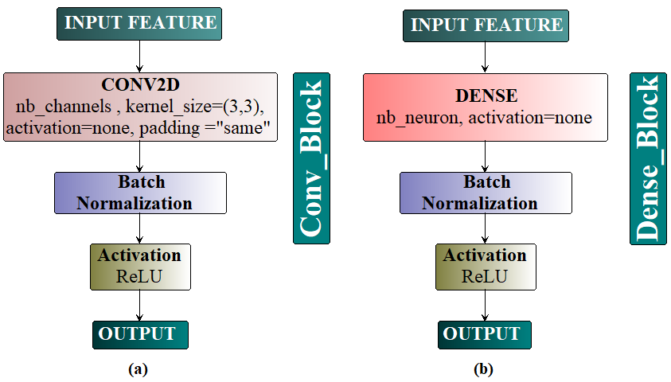

# Table of Contents

- [Model Architecture ](#model-architecture)
     - [Sub-Modules](#sub-modules)
     - [General Architecture](#general-architecture)
- [Results](#results)
     - [Training Graphs](#training-graphs)
          - [40X Data  [Best Model - Graph]](#40x-data-best-model-graph)
          - [100X Data [Best Model - Graph]](#100x-data-best-model-graph)
          - [200X Data [Best Model - Graph]](#200x-data-best-model-graph)
          - [400X Data [Best Model - Graph]](#400x-data-best-model-graph)
          - [Combined Data - Benign/Malignant Classification [Best Model Graph]](#combined-data---benignmalignant-classification-best-model-graph)
          - [Combined Data - Sub-Benign Diseases Classification [Best Model Graph]](#combined-data---sub-benign-diseases-classification-best-model-graph)
          - [Combined Data - Sub-Malignant Diseases Classification [Best Model Graph]](#combined-data---sub-malignant-diseases-classification-best-model-graph)
     - [Confusion Matrixes](#confusion-matrixes)
          - [40X Data [Best Model Confusion Matrix & ROC Curve]](#40x-data-best-model-confusion-matrix--roc-curve)
          - [100X Data [Best Model Confusion Matrix & ROC Curve]](#100x-data-best-model-confusion-matrix--roc-curve)
          - [200X Data [Best Model Confusion Matrix & ROC Curve]](#200x-data-best-model-confusion-matrix--roc-curve)
          - [400X Data [Best Model Confusion Matrix & ROC Curve]](#400x-data-best-model-confusion-matrix--roc-curve)
          - [Combined Data - Benign/Malignant Classification [Best Model Confusion Matrix & ROC Curve]](#combined-data---benignmalignant-classification-best-model-confusion-matrix--roc-curve)
          - [Combined Data - Sub-Benign || Sub-Malignant Diseases Classification [Best Model Confusion Matrix]](#combined-data---sub-benign--sub-malignant-diseases-classification-best-model-confusion-matrix)
- [Best Pretrained Weights](#best-pretrained-weights)
- [Requirements](#requirements)
- [Training](#training)
- [Citation](#citation)  
     
# Model Architecture 
## Sub-Modules
<table width="100%" border="1">
  <tr>    
  <td></td>
  <td></td>
  </tr>
</table>
<br>
<table width="100%" border="1">
  <tr>    
  <td></td>
  <td></td>
  </tr>
</table>
<br>

## General Architecture
<p align="center">

</p>
<br>

# Results
## Training Graphs

#### 40X Data [Best Model Graph]
<table width="100%" border="1">
  <tr>    
  <td></td>
  <td></td>
  </tr>
</table>

#### 100X Data [Best Model Graph]
<table width="100%" border="1">
  <tr>    
  <td></td>
  <td></td>
  </tr>
</table>

#### 200X Data [Best Model Graph]
<table width="100%" border="1">
  <tr>    
  <td></td>
  <td></td>
  </tr>
</table>

#### 400X Data [Best Model Graph]
<table width="100%" border="1">
  <tr>    
  <td></td>
  <td></td>
  </tr>
</table>

#### Combined Data - Benign/Malignant Classification [Best Model Graph]
<table width="100%" border="1">
  <tr>    
  <td></td>
  <td></td>
  </tr>
</table>

#### Combined Data - Sub-Benign Diseases Classification [Best Model Graph]
<table width="100%" border="1">
  <tr>    
  <td></td>
  <td></td>
  </tr>
</table>

#### Combined Data - Sub-Malignant Diseases Classification [Best Model Graph]
<table width="100%" border="1">
  <tr>    
  <td></td>
  <td></td>
  </tr>
</table>
<br>

## Confusion Matrixes
#### 40X Data [Best Model Confusion Matrix & ROC Curve]
<table width="100%" border="1">
  <tr>    
   <td></td>
   <td></td>
  </tr>
</table>

#### 100X Data [Best Model Confusion Matrix & ROC Curve]
<table width="100%" border="1">
  <tr>    
  <td></td>
  <td></td>
  </tr>
</table>

#### 200X Data [Best Model Confusion Matrix & ROC Curve]
<table width="100%" border="1">
  <tr>    
  <td></td>
  <td></td>
  </tr>
</table>

#### 400X Data [Best Model Confusion Matrix & ROC Curve]
<table width="100%" border="1">
  <tr>  
  <td></td>
  <td></td>
  </tr>
</table>

#### Combined Data - Benign/Malignant Classification [Best Model Confusion Matrix & ROC Curve]
<table width="100%" border="1">
  <tr>    
  <td></td>
  <td></td>
  </tr>
</table>

#### Combined Data - Sub-Benign || Sub-Malignant Diseases Classification [Best Model Confusion Matrix]
<table width="100%" border="1">
  <tr>    
  <td></td>
  <td></td>
  </tr>
</table>


# Best Pretrained Weights
| Data Type | Fold | Accuracy | F1-Score | Pretrained Model Link |
| --- | --- | --- | --- | --- |
| 40X | 4/5 | 0.979 | 0.976 | <a href="https://drive.google.com/open?id=11zeJ1gxTNwLFYpLgJLhuB3dCQQumy8oe" target="_blank">GDrive[Best Model]</a> |
| 100X | 4/5 | 0.978 | 0.975 | <a href="https://drive.google.com/open?id=1gZEq-xnurwFmhqZ8oUqpM6ic-ZEX9hJ7" target="_blank">GDrive[Best Model]</a> |
| 200X | 3/5 | 0.985 | 0.982 | <a href="https://drive.google.com/open?id=1RpEXjN83oHfVfw6BNXV11sUWHCRQb1kP" target="_blank">GDrive[Best Model]</a> |
| 400X | 4/5 | 0.958 | 0.952 | <a href="https://drive.google.com/open?id=1c-nAOTuzhDyebH8ANKiO_12fxu1l3Pu0" target="_blank">GDrive[Best Model]</a> |
| Combined Benign/Malignant | 5/5 | 0.988 | 0.985 | <a href="https://drive.google.com/open?id=11p9RrkZz1c8WV-kuoVqIIeS3-9p0CC1I" target="_blank">GDrive[Best Model]</a> |
| Combined Sub-Benign | 5/5 | 0.955 | 0.950 | <a href="https://drive.google.com/open?id=1yysBT_QfPw_TwZb7q5zEiSjwFRRmyGRy" target="_blank">GDrive[Best Model]</a> |
| Combined Sub-Malignant | 3/5 | 0.928 | 0.920 | <a href="https://drive.google.com/open?id=1-aqYUC9bjfU80035rr-YuF42-Dqhxcw-" target="_blank">GDrive[Best Model]</a> |

# Requirements
- keras
- tensorflow
- albumentations
- matplotlib
- numpy
- Pillow
- scikit-image
- scikit-learn
- tqdm

# Training
Download and extract <a href="https://web.inf.ufpr.br/vri/databases/breast-cancer-histopathological-database-breakhis/" target="_blank">Breast Cancer Histopathological Database (BreakHis)</a> into "data" folder. Then choose the IPython Notebook to train and test the model.

# Citation
```
M. Togaçar, K.B. Özkurt, B. Ergen et al., BreastNet: A novel ˘
convolutional neural network model through histopathological images for the diagnosis of breast
cancer, Physica A (2019), doi: https://doi.org/10.1016/j.physa.2019.123592 .
```
# Contact
If you have any questions about the research, feel free to ask! 
<hr>


```
E-mail: kutsal_baran@hotmail.com
```
